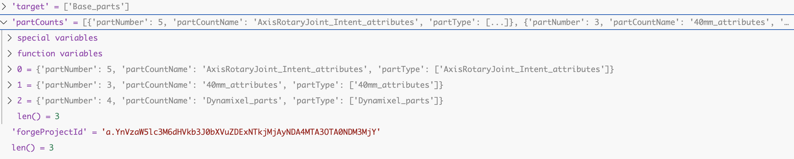

# Aktuelle Todos

# Fragen Conni
Vorschlag Python subprocess?
UI Abläufe klären:
    alles mit einem Button (quasi -> lade experiment konfig und rest passiert)
    zwischendurch klicks und BO updated schrittweise -> zum debuggen nicer
die Steps unten einmal durchgehen
data/taxonomy durchgehen -> was wird hier mit counts angepasst
einmal in requestsynthesis reindebuggen und request angucken mit dynamixel = irgendwas

BO läuft im backend
BO endpoint starten
im backend läuft statemachine

# Steps für Minimalziel

1. Konfig File für complete Simulation (yaml) -> optional
LOOP:
2. predicates schreiben
    anfrage an data/taxonomy/project_id für parts
    synthesis request aus part list generieren (counts/bzw welche parts verwendet werden sind parameter)
    project_id und result_id weiterverwenden
    synthesize_with_vector does this
3. Synthese Roboter Automatisch mit predicates (TODO predicates in synthese integrieren)
4. Auswahl günstigers (TODO price per part list integrieren)
    mit cached result günstigstes auswählen
    bei get("/results/{project_id}/{request_id}/cheapest assembly holen
5. SRDF und alles was moveit setup assistant macht ersetzen durch code
    assembly exportieren
6. motion planning scenario ausführen aus fusion heraus
7. erfolg und time taken wegschreiben
    result folder location anpassen
8. results in BO framework und nächste predicate configuration sollte output sein
9. goto 3
10. abbruch nach 10 steps oder so (wie in Konfig definiert)

state machine im backend implementieren

predicates
anzahl motoren
axisrotaryjointintent (0 sollte schlecht sein) basis ist sowieso schon am rotieren
68MM_mounting formats taxonomy -> doppelmotoren nicht unbedingt wichtig
torque auch erstmal egal
extrusion types 40mm types
predicate mit 3 dingern:
anzahl motoren -> Dynamixel 0-7
axisrotaryjointintent -> 0-7
40mm -> 0-5

pixi shell im backend laufen lassen und ansprechen
docker container für motion planning schreiben

